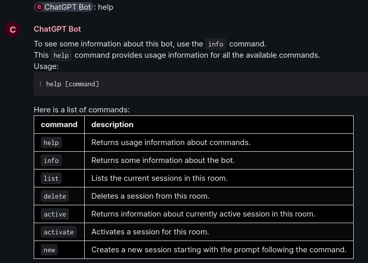
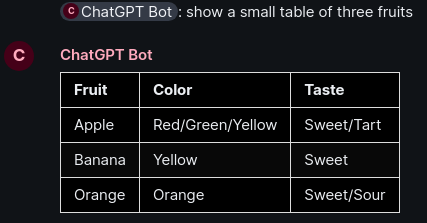
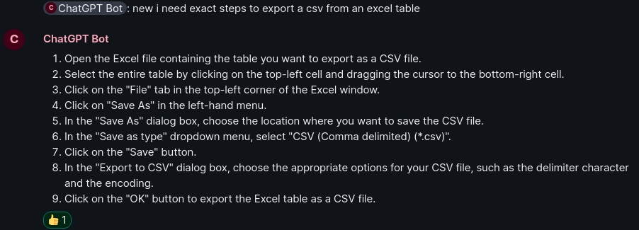
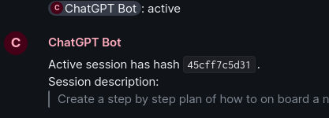
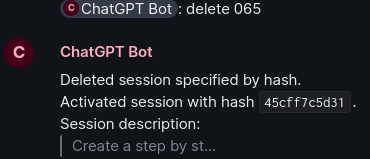
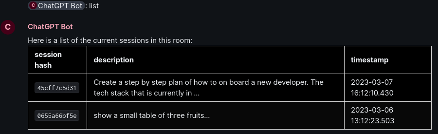

# Matrix AI Assistant

This is a small bot for matrix which brings [chatgpt](https://openai.com/blog/chatgpt) functionality into any matrix room so that it can be collaboratively used.

Once the bot is invited to a room, it will join and wait until it is mentioned in a message. The bot supports multiple _sessions_ just like the chatgpt webinterface and saves session history in a SQLite database. Sessions can be managed with different commands (see [examples](#examples)).

**Please note**:

- Currently it only works in unencrypted rooms.
- This is hacky, I created it in a few hours.

## Examples

Here are some example screenshots. The `help` command is used to get a list of available commands.



With no commands, the bot will respond with an answer generated by the openai API.



The `new` command starts a session.



There are multiple commands to manage the sessions.







## Install & run

[Poetry](https://python-poetry.org) is used for dependency management. 

Install dependencies:

```sh
poetry install
```

Provide environment variables or a `.env` file with these variables:

```sh
# Set to true to run productively.
PRODUCTION=false
# Path to an sqlite db. If it doesn't exist, it will be automatically created!
DB_PATH="./mydb.db"
# Matrix homeserver url.
MATRIX_HOMESERVER="https://my.matrix.home.server"
# User name of the user used as the bot.
MATRIX_BOT_USERNAME="ai-assistant"
# An access token fot the user.
MATRIX_ACCESS_TOKEN="syt_MY_SECRET_TOKEN"
# An OpenAI API access key
OPENAI_API_KEY="my-secret-openai-api-key"
```

(More configuration options will be added in the future.)

Finally, run the bot:

```sh
poetry run matrix-ai-assistant
```

## Roadmap

This is written in python. Currently the code base is messy and I want to rewrite everything in [golang](https://golang.org). See the golang branch.

Here is a list of possible future improvements:

- [ ] Restructure codebase, add tests and more documentation.
- [ ] Containerize the application.
- [ ] Replace/stop using [simplematrixbotlib](https://github.com/i10b/simplematrixbotlib) and just use [nio](https://github.com/poljar/matrix-nio) directly.
- [ ] Support encrypted rooms.
- [ ] Handle things like connectivity loss to matrix server better.
- [ ] More configuration options.
- [ ] Introduce a usage quota per room to better control API fees.
- [ ] Save users in database and introduce a usage quota per user.
- [ ] Better control over the openai API.
    - [ ] Better control regarding token limit.
    - [ ] Better error handling (currently hard to do with the openai python package).
- [ ] Better control over the context and how much history is sent to the API.
- [ ] More modularized way to interact with API in order to support more/different APIs (Idea here is to let one swap out the API or model used).
- [ ] Different database schema where active session is not based on timestamp.
